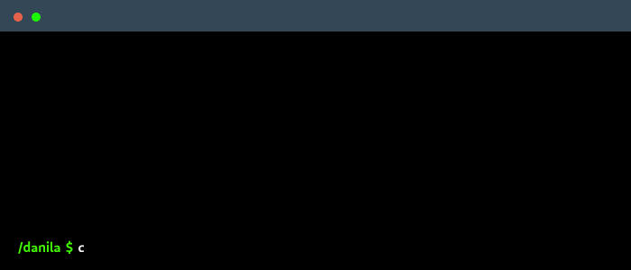

<!-- -->

## About Me

- Currently a student at **TUM University** (Technische Universität München), studying **Data Science and Management**.
- Learning & building portfolio in Front-End development, networks, and machine learning.
<!--

    

-->

## Tech Stack:
          

## Connect with Me

- Message me on [LinkedIn](https://www.linkedin.com/in/dkzhukov) if you're into AI, coding or business.

 
